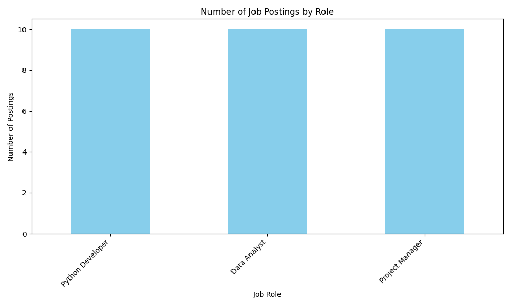
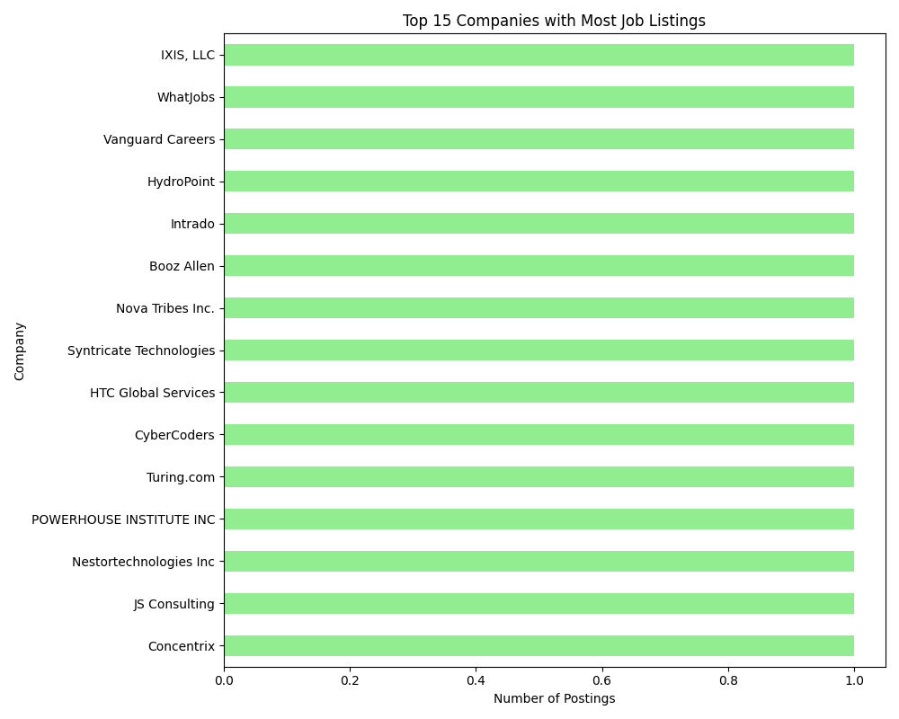

# Automated Job Market Analyzer 📊

This project is a fully automated job market analysis tool that runs weekly using Python and GitHub Actions. It scrapes job data for specified roles, analyzes the results, and automatically generates and updates charts with the latest insights.

---

### ✨ Live-Updating Charts

These charts are automatically updated every Sunday at midnight UTC by the GitHub Actions workflow.

#### Job Postings by Role


#### Top 15 Companies Hiring


---

### 🚀 Features

- **Automated Scraping:** Uses the SerpApi Google Jobs API to fetch current job listings.
- **Data Analysis:** Leverages the pandas library to process and analyze job data.
- **Chart Generation:** Creates clear and insightful visualizations using Matplotlib.
- **Scheduled Automation:** A GitHub Actions workflow runs the entire process automatically every week.
- **Auto-Commit:** The workflow automatically commits the updated charts back to the repository.

### 🛠️ Tech Stack

- **Language:** Python 3.10
- **Libraries:**
  - `pandas` for data manipulation
  - `matplotlib` for data visualization
  - `google-search-results` (SerpApi) for data scraping
- **Automation:** GitHub Actions

### ⚙️ How It Works

1.  A GitHub Actions workflow is scheduled to run weekly (or can be triggered manually).
2.  The workflow sets up a Python environment and installs the required dependencies from `requirements.txt`.
3.  The `job_analyzer.py` script is executed.
    - It fetches job listings for a predefined list of queries (e.g., "Python Developer", "Data Analyst").
    - It processes this data into a pandas DataFrame.
    - It generates two PNG charts visualizing the data.
4.  The workflow then automatically commits the newly generated chart files in the `charts/` directory back to the `main` branch.

### 🔧 Configuration and Setup

To run this project yourself:

1.  **Fork and Clone:** Fork this repository and clone it to your local machine.
2.  **Install Dependencies:** It's recommended to use a virtual environment.
    ```bash
    python -m venv venv
    source venv/bin/activate
    pip install -r requirements.txt
    ```
3.  **Set Up Secrets:**
    - Get an API key from [SerpApi](https://serpapi.com/).
    - Add this key as a repository secret in your GitHub repository's settings under `Settings > Secrets and variables > Actions`. Name the secret `SERPAPI_KEY`.
4.  **Grant Permissions:** Ensure your GitHub Actions workflow has write permissions so it can commit files. Go to your repository's `Settings > Actions > General` and under "Workflow permissions," select "Read and write permissions."

### ✏️ Customization

You can easily customize the job search by editing the following variables at the top of the `job_analyzer.py` script:

- `JOB_QUERIES`: A list of job titles you want to track.
- `LOCATION`: The geographical location for the job search.
